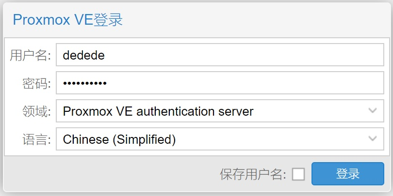
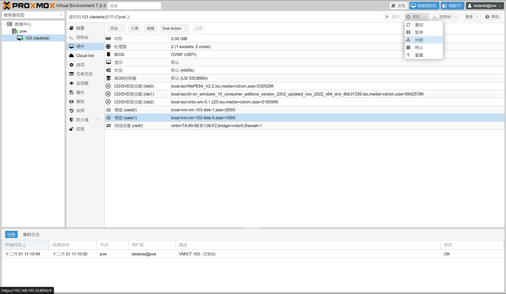
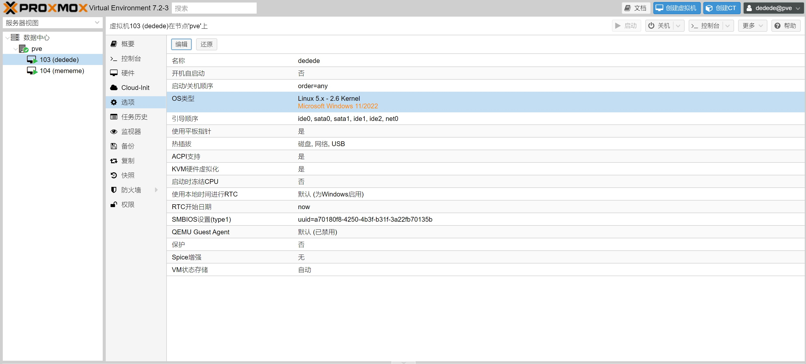

# 考试要求

## 你可以

1. 现场查阅各种资料，包括 Bilibili 视频教程、科服 Wiki、本考试标准和要求
2. 考前请求其他队员辅导
3. 在无原则性错误的前提下申请无限次补考
4. 特殊情况滴滴监考或队长

### 你不可以

1. 现场拷问其他队员，或携带其他同学作为参考资料
2. 违规操作，导致硬件损坏或数据丢失

### 你应该

1. 注意维护测试用设备，注意螺丝刀等工具的使用规范，尤其不能滑牙
2. 在监考员认为不可以的时候听从他/她

## 监考员可以

1. 针对队员*明显没有发现的*错误操作进行一个指的出，并在小本本上记一笔
2. 提示考纲外的部分知识
3. 鼓励参评队员

### 监考员不可以

1. 提示考纲内的操作知识
2. 接受参评队员的投喂
3. 嘲讽参评队员

### 监考员需要对三个科目分别准备

1. 对于科目一，预先将 sm961、860evo 安装回机器中，并连接好线缆，删除两块硬盘的分区以备装机
2. 对于科目二，预先将 sata m.2 ssd 安装到笔记本中，删除 sm961 中的分区以便系统迁移
3. 对于不与科目一一起测试的科目三，预先将 sm961 安装到笔记本中，删除 sm961 中的分区以便系统迁移

# 考试设备

1. 测试平台陈列在 223 桌面或货架上
2. 笔记本陈列在 6 号柜中间，包括电源
3. 6 号柜还有 256G SM961 磁盘，该磁盘记为 1 号（可能装在笔记本中）
4. 6 号柜还有 860 sata 硬盘一个，该硬盘记为 2 号
5. 6 号柜还有 m.2 128g sata 协议 ssd 一个，该硬盘记为 3 号

# 科目一：台式机拆机与装机

## 考核内容

1. 将台式机拆除为零件状态，需要满足以下条件才可被认为是拆除完成：

   - 散热、显卡、主板、硬盘、电源均从机箱中拆除，机箱后 IO 挡板被拆除，拆下至少一个主板固定铜柱
   - 散热器、散热器扣具、CPU、内存、M.2 固态硬盘均需从主板上拆除，并妥善保存
   - 处理器上：旧硅脂基本擦除
   - 电源：拆除所有模组线，并妥善保存

2. 重新装机，需满足以下条件才可认为是装机完成：
   - 处理器上涂抹有适量硅脂
   - IO 面板得到正确安装，拆下的主板固定铜柱被正确地安装回去
   - 处理器、扣具、M.2 硬盘（1 号）和内存均被正确安装回主板上
   - 电源模组线得到正确安装
   - 电源、主板、sata 硬盘（2 号）、显卡、散热均正确安装回机箱内，并确保所有螺丝孔位均有正确型号的螺丝固定
   - 可以正常进入先前已安装的系统
3. 可选：使用 WePe 在固态硬盘内安装 windows10 系统，若选择安装 windows 系统，无需额外完成科目二或科目三  
   参考科目三内容

## 注意事项

1. 注意操作规范性，例如：防静电、避免损坏硬件、注意数据安全
2. 有出现因错误操作导致硬件损坏、数据丢失的，考核成绩不合格
3. 结束后整理台面

# 科目二：更换笔记本固态并进行系统迁移

## 考核内容

1. 拆开笔记本
2. 拆下旧固态硬盘（3 号），安装新固态硬盘（1 号）
3. 安装笔记本，确保正常开机，功能正常

4. 设置 U 盘位第一启动项，从 U 盘内的 WePE 系统启动电脑
5. 使用 diskgenius 或傲梅分区助手完成系统迁移
6. 确保完成迁移后系统功能保持正常(注意,SATA 硬盘迁移到 NVMe 硬盘时需要更改注册表)

## 注意事项

1. 注意操作规范性，例如：防静电、避免损坏硬件、注意数据安全
2. 有出现因错误操作导致硬件损坏、数据丢失的，考核成绩不合格

3. 注意螺丝刀等工具的使用规范，用力下压再旋转。操作不当导致笔记本滑牙的，考核成绩不合格
4. 结束后整理台面

# 科目三：使用 WePE 在固态硬盘内安装 Windows 10 系统

## 考核内容

1. 对于不和科目一一起考核的，使用笔记本进行操作
2. 设置 U 盘位第一启动项，进入 WePE 系统
3. 使用傲梅分区助手或 diskgenius 完成固态硬盘分区（3 号或 2 号）
4. 使用 Dism++或 windows 安装器或 ISO 内 setup.exe 安装 windows 系统
5. 重启，完成 OOBE 阶段
6. 激活 windows
7. 使用 SDI 或 windows 自带系统更新完成驱动安装，确保设备管理器中没有未安装驱动的设备

## 注意事项

1. 注意操作规范性，例如：防静电操作，避免损坏硬件，注意数据安全
2. 有出现因错误操作导致硬件损坏、数据丢失的，考核成绩不合格
3. 注意螺丝刀等工具的使用规范，用力下压再旋转。操作不当导致笔记本滑牙的，考核成绩不合格
4. 结束后整理台面

# 线上考核:使用 WePE 安装 Windows10 系统后完成迁移

## 考核内容

1. 安装[zerotier](https://www.zerotier.com/download/),安装教程参考链接,无需创建账号,安装完成后根据监考员确定网络 ID,并链接之,并反馈自己的 Node Address 给监考.

   > 监考 王浩萌:  network ID:e5cd7a9e1c1f07ea
   > 监考 张钧:    network ID:a0cbf4b62a49f43f

2. 稍等片刻即可建立完成虚拟局域网,访问此[链接](https://192.168.195.33:8006/),根据监考员给出的用户名和密码登录.注意语言和域的选择.
   

3. 登录进入后可以看到 数据中心>PVE>104(mememe),103(dedede) 是两个虚拟机,至于虚拟机是什么,这不重要.我们的测试会在虚拟机上进行.mememe 用来练手的,可以胡搞,dedede 是用来正经测试的,请不要胡搞.  
   下图是点开 dedede 的硬件选项卡,可以看到这台虚拟机的全部硬件资源.
   
   右上角有关机,启动,停止,其功能分别是正常的关机,开机和长按电源键强制关机.从上到下三个 DVD 驱动器的内容分别是 WePE 镜像(类似 PE 盘),Win10 镜像(安装系统时使用),virt-io 驱动盘(安装完操作系统后安装驱动用).
   
   上图是选项界面,只需要关注引导顺序即可.注意将需要引导进系统的设备放在第一个并且打勾即可.比正经 BIOS 简单太多了!

4. 看到 mememe 了吗,那是已经引导进 WePE 系统的一台虚拟机,你可以随意折腾练手.

5. 现在准备给 100G 的那块硬盘里面安装一个 windows10 系统吧!下面是简单的步骤.
   - 引导进 WePE 镜像
   - 打开 diskgenius,使用"快速分区"功能对 100G 硬盘分区成"GPT(GUID)分区表"的硬盘,分区数量为 1(使用 MBR/legacy 安装不能算作通过测试!)
   - 使用 windows 安装器选择 windows10 安装镜像中 sources/install.wim 作为镜像,100G 硬盘中的 ESP 分区和系统分区作为安装目的地,开始安装系统.
   - 完成 OOBE 阶段,用户名为 admin,密码为空.
   - 进入设备管理器,为带感叹号的虚拟网卡和 PCI 设备安装驱动,驱动在 virt-io DVD 光盘中.[教程](https://blog.csdn.net/allway2/article/details/103125982)
   - 激活windows系统
   - 完成后叫监考过来验收

6. 安装完系统后就可以迁移系统了!下面是一些个步骤.
   - 引导进WePE镜像
   - 打开diskgenius,使用"磁盘克隆"将100G硬盘中已经安装的系统盘完整克隆到200G硬盘中.注意尾部空间分配.
   - 迁移完成后记得修引导哦
   - 关机,在网页管理中的硬件选项分离100G硬盘.记得调整引导顺序哦
   - 开机,叫监考过来验收.

## 注意事项

1. 上面每一步真的都是我一步一步实验的了,按照步骤来真的没问题
2. 记得登陆进来的时候选中文,虽然中文有时候看的比英文还困难就是了
3. 有啥不懂的问监考吧,,虽然其实教程真的已经肥肠细了
