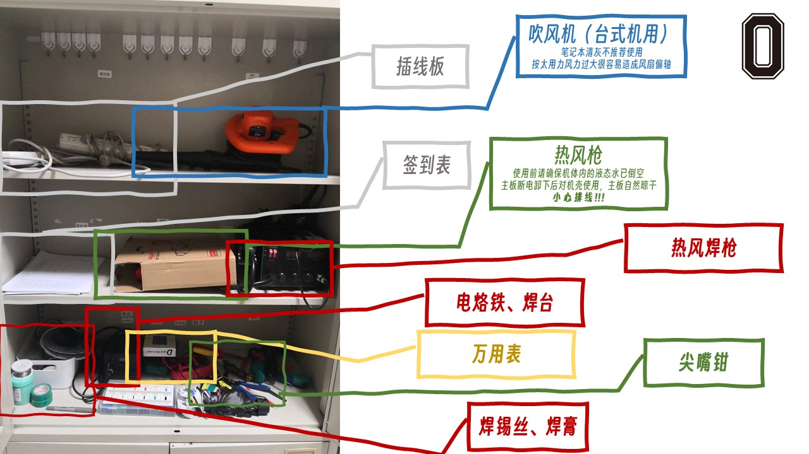
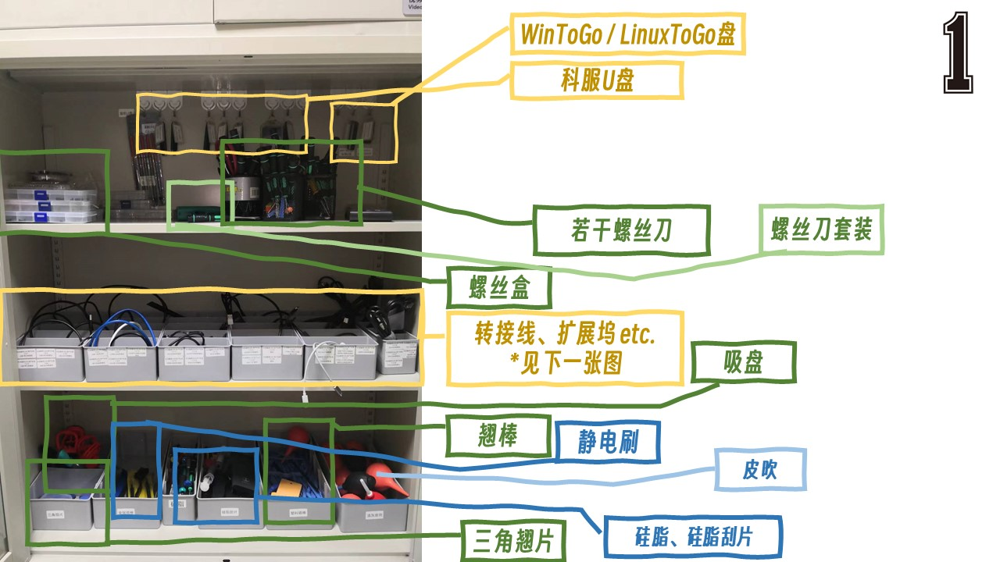
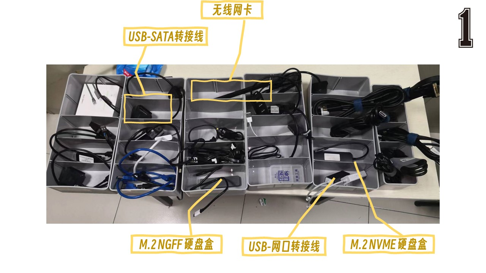
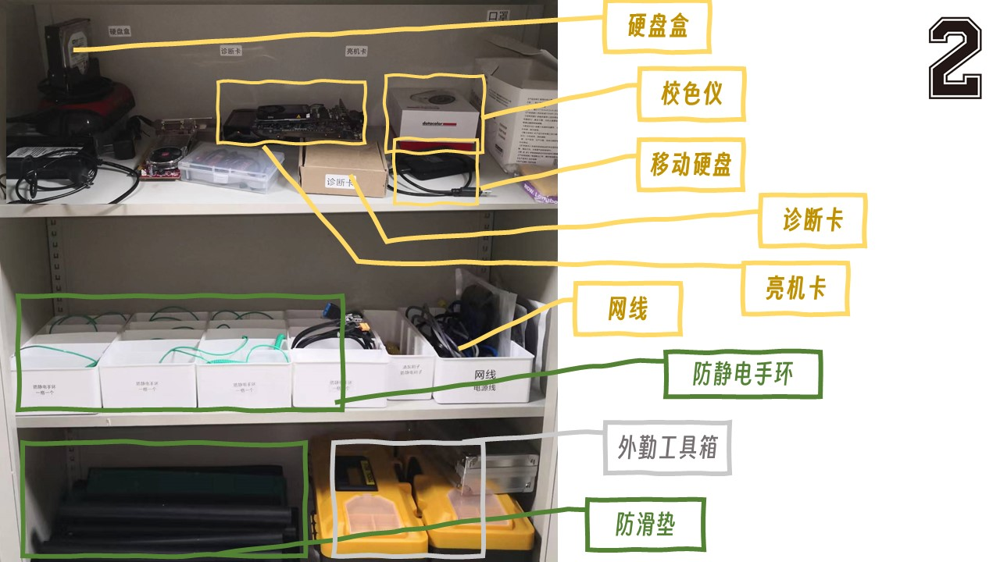
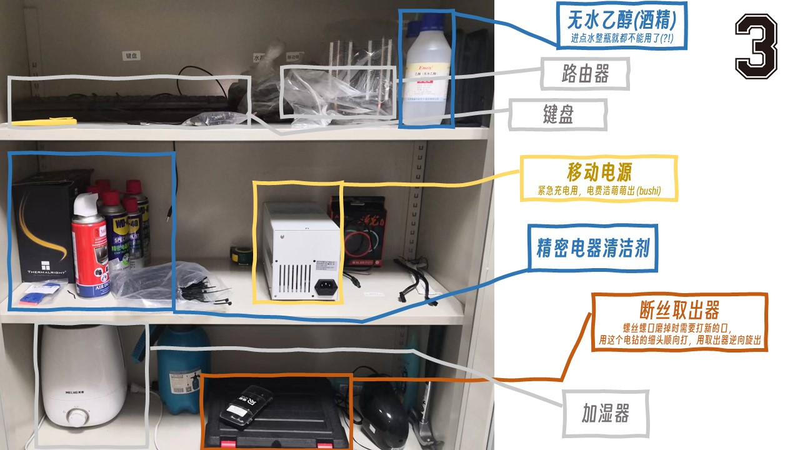

# 资产管理办法
## 队员借用  
1. 队员借用工具须在企业微信-本批次工作群中拍照登记。对于以下几种工具，需等待分队委或负责人回复后才可带离223借用；对于不在下表中的工具，队员在登记后无需等待回复确认即可带离223.建议在借用下表中的工具前与分队委或负责人沟通，避免等待回复时间太长。 
    - 校色仪  
    - 热风焊台  
    - 显卡  
    - 测试平台及零件  
2. 队员需在借用后下一个C楼线下班上班前归还工具
3. 对于丢失或超期借用的工具，分队委员会有权通过扣除工时来抵扣分队财产损失
## 来访师生借用
1. 来访师生借用工具需与至少一位队员交换联系方式作为联系人，留存联系方式后需扫描223门口二维码填写借用登记，队员报分队委或负责人，经分队负责人确认后来访师生方可将工具带离223
2. 下表中的工具，谢绝借用
    - 科服装机盘
    - 科服WinToGo U盘
    - 校色仪
    - 热风焊台、热风枪
3. 来访师生须在借用后下一个C楼线下班上班前归还工具
4. 对于出借工具后来访师生无法取得联系的，无法归还的，科技服务分队会通过公众号通知来访师生归还，并在归还后撤销通知
5. 当班队员违规出借物品导致物品丢失的，由组长承担责任

# 0号柜

# 1号柜

- 科服U盘：
  - 装机盘：见装机培训
  - Win PE盘：修复引导，建议线下学习使用
  - 科服工具箱1.0：进入系统后整些骚操作
  - 在[NAS](http://nas.kjfwd.com:31200/)上有提供完整的科服U盘制作教程，NAS路径为`上传文件夹 > 科服多引导系统盘`，按`科服系统盘制作教程.docx`操作即可；安装完毕后，可以在一个新的分区保存科服工具箱，NAS路径为`share > 应用软件 > 工具 > 科服工具箱1.0`

- 中间层见下图：

    

    哎呀这些线咋这么乱呢 ⊙﹏⊙∥ TODO: 整理 + 重新标记

# 2号柜

- 校色仪：[教程](http://wiki.kjfwd.com:3000/zh/manual/Calibrator)
- 诊断卡：TODO

# 3号柜

