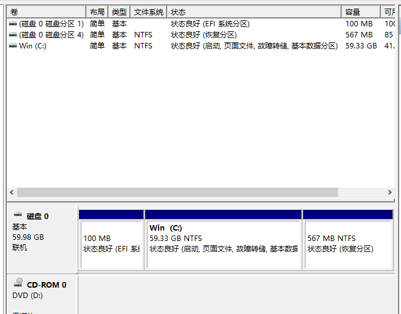
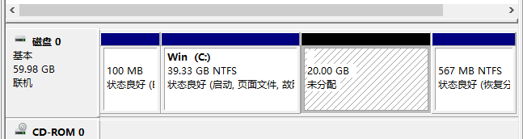
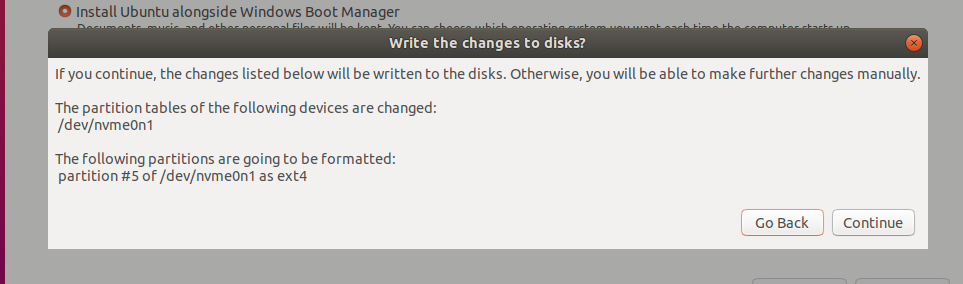
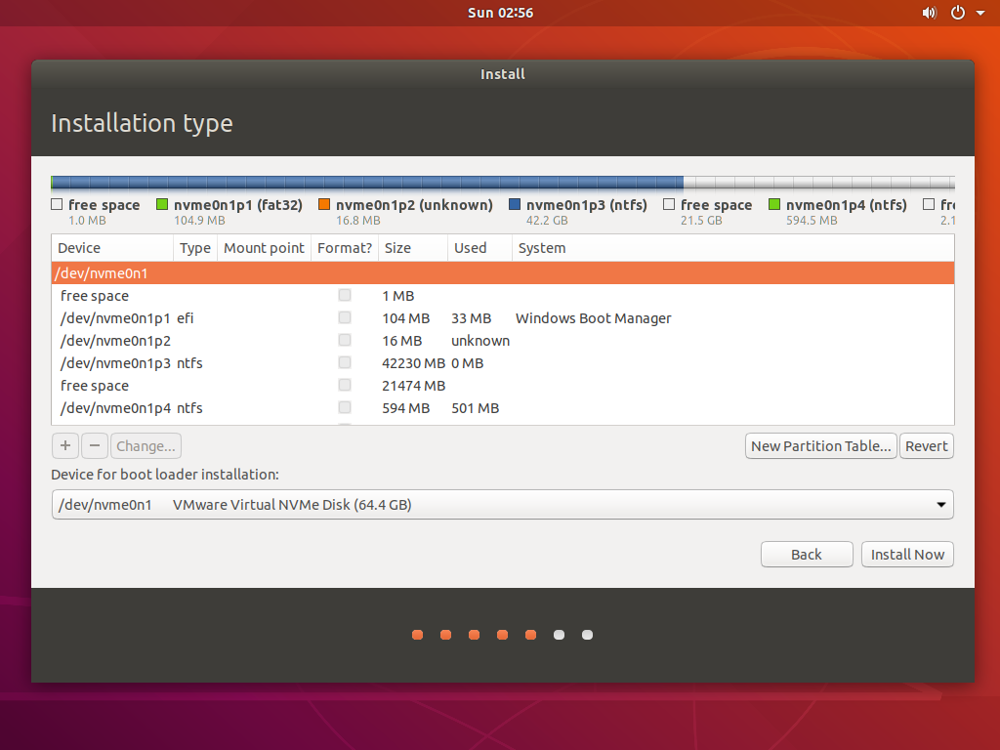
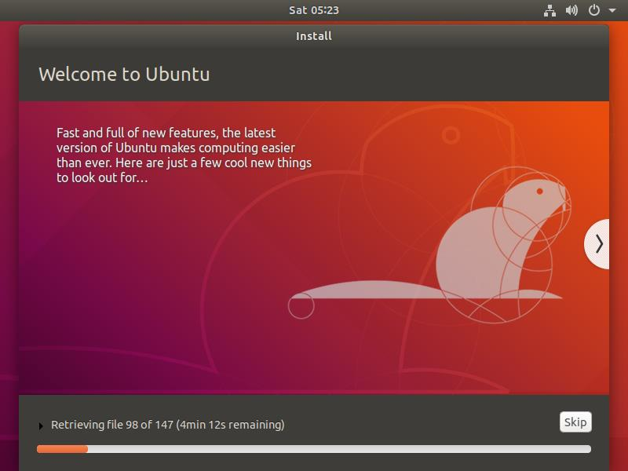
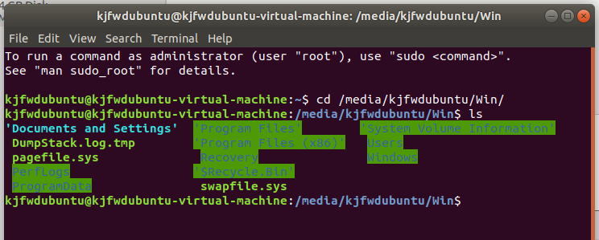

# Windows + Linux（Ubuntu） 双系统安装教程

## 说在前面

本次教程面向对象为**从Windows安装Windows+Linux双系统**的教程，并采用Linux最常见（因此网上教程最为丰富）的发行版**Ubuntu**作为示例。作为实用教程，并不涉及**为何要使用Linux、怎么使用Linux、怎么使用Linux虚拟机或WSL**等问题的解答。同时本教程并未涵盖所有意外情况，如果遇到，请随时加科技服务队微信群，或在晚上7：00~10：00至C224线下求助。

根据前人经验，常会出现这种情况：

> 每到新学期前两周，科服总会迎来一批又一批说要来“装一个linux 双系统”的客户。他们来自不同的专业，要用不同的软件，但共同点是都不太熟悉linux，都被老师/师兄师姐说“要装个linux才能 blablabla”，都一脸懵逼的来到了 C 楼，很多时候自己也说不清到底需要什么。

如果你是这样的，那就看下去吧，跟着这个教程没错。

## 基础知识

### 关于Linux

Linux是一个类似于Windows和MacOS的操作系统，他有一些独有的特性，同时也是一定的门槛。

**开源** linux 内核本身是开源的，也就是说大家都可以免费看到 linux 内核的源码，了解这一伟大的系统是怎样一行一行被开发出来的，甚至也可以贡献自己的代码，造福无数人。对于普通用户而言，我们也可以**免费地获取**编译好的大部分 linux 发行版安装程序，这意味着我们再也不需要盗版/破解/教育版/激活码之类的东西，下载安装即正版。
**开放** linux 给予了用户很高的权限，通过简单的指令我们就可以读/写计算机里的各种核心功能。而在 Windows/MacOS 中这些事情往往要么不可能，要么需要经过繁杂的权限策略管理。但需要注意，给用户高权限同时也意味着**用户可以轻松搞崩系统**（例如格式化全盘），使用时也要多加小心。
**满足*基本*的办公需求** 相比 Windows 和 MacOS，Linux 仍然只是个小众系统，但对于简单的办公/娱乐需求肯定还是可以满足的。比如 Office 蓝绿橙三件套、中文输入法、微信、Chrome、Firefox、zoom、teamviewer、媒体播放器等等。（Linux 版本的国产软件，功能可能不太全，但流氓行为相比 Windows 版会少很多）（所以说如果有软件只有Windows版，强烈不建议只用Linux）
为了让普通人也能正常使用 Linux 系统，开源社区为大家提供了许多的 Linux 发行版(Distribution)。发行版就是一个完整的 OS 了，可以像安装
Windows 一样的流程，搜索安装包、做安装盘、设置新电脑的启动项、安装系统。因此大家在准备安系统的时候，不要搜索下载“Linux 系统安装包”，而是去找“Ubuntu 安装包”之类的具体发行版。本文只简单介绍一下 Ubuntu——最常见、最适合入门、最通用、教程最多、使用最广的发行版。

### 关于Ubuntu

上图是Ubuntu 16.04 桌面和一个打开的系统设置窗口。可以看到，经历这些年的发展与进化，Linux 发行版可以对新手很友好。大家熟悉的桌面、窗口、任务栏、文件资源管理器、Office 套件、应用商店、网络/输入法/音量/时间地区调节，基本都可以无缝切换到Ubuntu 系统里，用的仍然是大家最熟悉的键盘鼠标。因此不用担心，对于非计算机专业、只用 Linux 做一点事的同学而言，可以不学 Shell 操作，让科服队员来帮忙配一些基本东西后，保持只用图形界面的基本操作。但对于更多的 Linux用户，在绝大多情况下 Shell 更加的强大和便捷。

总而言之，我们并不推荐小白直接迁移到 Linux （单）系统，会造成很多使用上的不习惯，希望你三思而后行。

### 关于双系统

早在虚拟机诞生之前，双系统/多系统就已经在装机折腾界流行。至今仍活跃在各种学校机房——当一台机器需要供很多个班上课，而不同的教学用软件分别只支持 Win10、Win7、WinXP 的时候。你就会在开机的时候看到一个画风突兀的，让你选择开启哪个系统的界面。
双系统的原理并不复杂。 首先，BIOS 里可以设置启动顺序，列表中可以排序的元素包括所有硬盘、U 盘、光盘、网络等等。这意味着 BIOS 将按照这一指定的顺序挨个询问这些设备，有没有可以启动的操作系统。之后，BIOS 将尝试装载和启动找到的第一个 OS，并移交硬件控制权。如果实际上有两个（或多个）系统可以启动，但 BIOS 只认一个，这个机器就可以称为双系统（多系统）的计算机。
启动系统的选择也可以放在引导里。例如下文演示的 Win+Ubuntu 双系统，BIOS 默认加载 grub 引导，而用户可以在 grub 中选择加载哪个 OS。这种方案使得双系统的启动更加优雅，不再需要每次改 BIOS 的 boot option，但在卸载其中一个系统，清理引导的时候比较麻烦。

双系统的优点：等同于物理机的性能；两系统分别可以占用所有的系统运行资源。

双系统的缺点：多系统不能同时开启；系统间交换数据不便；系统间硬盘空间分配方案的修改不便。

## 双系统安装Ubuntu

~终于到正文了~
预警：双系统/多系统是比较容易踩坑的方案，不推荐大家在自己的生产力机器上作死。~或者直接找科技服务队~

本章继续走一套最常见的双系统流程：在 Win11 系统上，安装 Ubuntu 双系统，再卸载 Ubuntu。

### Windows分区

首先，示例的系统环境是一个最普通的 Win11 机器，版本是 2004 专业教育版，总硬盘空间 60G。

为了便于之后分辨盘，将 C 盘的卷标改为 Win。
压缩 C 盘，留出 20G 空间给 Ubuntu（此处硬盘空间大小请根据自己情况指定，考虑未来工作，建议不小于20G）。
压缩出来的空间不必再新建分区和格式化，交给 Ubuntu 一块未分区的空间即可。

### Ubuntu安装盘制作

推荐使用8G以上U盘，警告：**制作之前请将U盘内数据备份**，制作过程中需要格式化，**数据无价，谨慎操作**。
有多种方法制作，本人极其推荐使用Ventoy。

#### 获取Ubuntu系统镜像

正如 Windows 会有 11 / 10 / 8 / 7 / Vista / XP / 2000 / Me / 98 / 95 等等系统一样，Ubuntu 经过这些年的发展也形成了一套比较成熟的版本迭代策略。

对于普通用户而言，一般选择 Ubuntu 的 LTS (Long-Term Support) 版本。LTS 可以简单理解为稳定版，比一般的正式版更加推荐使用。近年，LTS 的编号都是”偶数.04”的形式，包括 14.04,16.04, 18.04, 20.04,22.04。~其中 20.04 为最新的 LTS 版本~2022年更新，22.04为最新LTS版本，但由于种种原因，个人经验见到使用最多的还是 16.04。大家可以根据自己的实际需求（问老师/助教/师兄师姐）选择版本。稳定性考虑，一般不建议选择非 LTS 版本。
Ubuntu 的开发者有个奇葩习惯，用奇怪的词给每个大版本起代号。在有的地方会直接以代号称呼版本，例如 Xenial 指代的就是 16.04 版本，水母是22.04等等。
国内直连 Ubuntu 官网可能速度一般。推荐大家从清华大学开源镜像站(TUNA, Tsinghua University ~Nvzhuang~ Association)下载。TUNA 是我清众多神仙社团中的佼佼者，里面各路巨佬众多，不仅深受校内广大计算机相关学子厚爱，甚至还走出校门，在国内社会上码农圈子里有一定影响力。

[https://mirrors.tuna.tsinghua.edu.cn/ubuntu-releases/](https://mirrors.tuna.tsinghua.edu.cn/ubuntu-releases/)

几个 LTS 版本都可以在上面的链接里找到。例如，下面安装教程使用的 18.04 版本的安装光盘镜像完整链接就是：

[https://mirrors.tuna.tsinghua.edu.cn/ubuntu-releases/18.04/ubuntu-18.04.5-desktop-amd64.iso](https://mirrors.tuna.tsinghua.edu.cn/ubuntu-releases/18.04/ubuntu-18.04.5-desktop-amd64.iso)

其他版本的完整路径也类似，不再赘述。下它，下就完了。

#### 使用Ventoy

> 有了Ventoy你就无需反复地格式化U盘，你只需要把 ISO/WIM/IMG/VHD(x)/EFI 等类型的文件直接拷贝到U盘里面就可以启动了，无需其他操作。你可以一次性拷贝很多个不同类型的镜像文件，Ventoy 会在启动时显示一个菜单来供你进行选择
> 你还可以在 Ventoy 的界面中直接浏览并启动本地硬盘中的 ISO/WIM/IMG/VHD(x)/EFI 等类型的文件。
> Ventoy 安装之后，同一个U盘可以同时支持 x86 Legacy BIOS、IA32 UEFI、x86_64 UEFI、ARM64 UEFI 和 MIPS64EL UEFI 模式，同时还不影响U盘的日常使用。
> Ventoy 支持大部分常见类型的操作系统 （Windows/WinPE/Linux/ChromeOS/Unix/VMware/Xen ...）Ventoy 是开源免费的软件。
>
> （摘自Ventoy官网 [https://www.ventoy.net/cn/](https://www.ventoy.net/cn) )

进入官网，直接下载Windows版本（这里因为众所周知的原因，推荐使用镜像站下载）。解压后用管理员权限打开Ventoy2Disk.exe，在设备中选择需要安装到的U盘的安装路径，点击安装即可。（**再次提醒，安装会格式化U盘，注意数据安全！！**）
安装完成后，U盘名字会变成Ventoy，直接将下载好的系统镜像复制进入U盘即可，Ventoy会自动扫描识别，同时可以正常使用U盘（这就是本人推荐的原因）。

#### 使用Rufus

下载（又是因为一些众所周知的原因官方下载不是很可行于是我们推荐[这个](https://www.fosshub.com/Rufus.html?dwl=rufus-3.20.exe)网站）后双击打开，选择下载好的Ubuntu镜像与安装盘，软件会自动设置，点击开始即可（**第三次提醒，开始会格式化U盘，记得备份！！！）**。

### Ubuntu安装

关闭 Win 系统，接入 Ubuntu 安装盘并从安装盘启动。
此处需要进入BIOS选择启动顺序，不同品牌进入BIOS操作不同，可以在网络上查询，一般都是开机后马上立即狂按F12即可进入。进入BIOS后，选择BOOT Option之类的选项，将Boot Priority#1设置为含有USB / Portable / Removable等等选项（即U盘），保存并退出以后重启电脑，即可完成从安装盘启动这一操作。

下图是安装Ventoy完成以后，从安装盘启动的界面。（source：官网）

下图是使用Rufus的安装界面。

这就是进入了 GRUB 界面，选择 Install Ubuntu，之后便回到了正常的安装过程。
语言建议默认选英语（因为众所周知的编码问题，选中文会出现一些玄学bug，不是很建议~毕竟都用Linux了~），键盘选默认 English(US)。接下来会给出 Normal 和 Minimal 两种安装方式。正如字面描述的，Normal 包含了浏览器、常规附件、office、小游戏、媒体播放器等等，而 Minimal 安装则最少化附件。实际上，不论选择哪个，都可以通过后期操作安装/卸载掉有差别的部分。这里我们选择 Normal 方式。下方的Download updates while installing Ubuntu 建议不选，因为此时系统会从默认来源（外网）下载系统更新，很慢。而最后一个 Install third-party……按自己需求决定，这里也暂不选。
在选择安装方式这一步的时候，Ubuntu 会提示已经检测到其它系统的引导（Windows Boot Manager）。

Install alongside 即傻瓜式安装，同时保留 Win 和 Ubuntu 两个系统，并且让 Ubuntu 来帮忙分好盘。Erase disk 当然就是直接格式干净 Win，把整个磁盘用来装 Ubuntu。最下面的Something else 即自定义安装，手动分好盘，指定 Ubuntu 安到哪里。
这里我们先选择第一项，Install aloneside，弹出提示即将进行的操作如下。

在 Linux 系统下，没有 C 盘 D 盘之类单个字母的卷标，只有/dev/下的设备文件来指代硬盘，例如上图 Ubuntu 就将这唯一的一块硬盘命名为了/dev/nvme0n1。可以看到 Ubuntu 自动分析了当前磁盘状况，决定把自己安装到/dev/nvme0n1 这块盘的 partition 5，并将其格式化为 ext4 格式。这里的 Patition5 就是刚刚在 win 系统的磁盘管理中留出的 20G 空间。

至此已经可以直接安装。如果暂不安装，返回，选择 Something else 来进一步查看分区。一般进一步分区能够更详细地掌控硬盘使用情况。

我们可以根据顺序、大小、类型来推测这一堆分区都是什么。第一行/dev/nvme0n1 是指整个盘，从第二行开始依次是盘里的分区：

* 不知道为什么冒出来的 1MB 空闲空间。
* 100M 的 Windows Boot Manager，即 win 系统的引导。
* 不知道为什么冒出来的 16MB 空间，实际上可能不存在的分区。
* 40G 的 Win 系统盘。
* 刚才用 Win 分配出来的 20G的空闲空间。也就是刚刚被自动命名为 partition5 的部分。
* 600M 的 Win 恢复分区。

我们在这时会进行Linux系统分区，各种方案都有，好坏无定论，实际上只分一个根目录，Linux也可以运行，但在这里我们推荐一种最简单最常见的分区方案，一共四个分区：

* 挂载点（Mount point）：**/boot**；大小500MB~1GB；*主分区（Primary）*；分区格式（Use as）ext4。——系统的boot启动引导项安装位置。在安装双系统时，这里会安装grub使得双系统能够同时引导。
* 挂载点（Mount point）：**swap**；大小推荐为机器内存1~2倍；*逻辑分区（Logical）*；分区格式（Use as）swap。——交换空间。充当虚拟内存。
* 挂载点（Mount point）：**/home**；*逻辑分区（Logical）*；分区格式（Use as）ext4。——相当于“我的文档”，大小建议能多大就多大，和根目录大小选择相关，需要权衡。
* 挂载点（Mount point）：**/**；*主分区（Primary）*；分区格式（Use as）ext4。——根目录，所有目录的根节点，其下包含很多子目录，如/usr  /tmp等。

> 补充知识：如何选择/home与/大小分配
>
> Linux的文件系统是一种树状的结构，一个软件会把包含的众多文件，放置在不同的目录当中，所以不同的使用目的，每个目录扩张的速度会不一样。在Mount point的下拉选项中就是各个目录。
> 例如，当计算机当作服务器使用时，由于变动的文件一般是位于/var当中，所以/var应规划足够的空间；当计算机当作日常桌用应用时，/home会增加使用量，所以/home要放大空间；若计算机中会安装大量的软件，那你可能需要增加/usr（在分区中也就相当于/）的空间。
> 当然，不把这些空间独立分割出去，一起使用/的空间，会有最好的空间使用效率，但这样容易造成系统不稳定，或其它的问题的情形发生。linux文件系统的根目录，是一定要挂载的。没有特定指定分区挂载的目录，都会与根目录放在同一个分区中。

首先点击 选中**free space** 空间，点击左下角的加号+，进行内存分配。下图是参考分配界面（source：CSDN, [地球被支点撬走啦](https://blog.csdn.net/Flag_ing "地球被支点撬走啦")）

然后就是 boot loader 的安装位置，在界面下方的 **Device for boot loader installation** 中选择刚才分配 **/boot** 的那块空间，如下，点击继续。

选择 Install Now 之后就进入了更细节的设置，不再逐步截图。简略介绍：

* 地区一般选择实际所在位置，东八区 Shanghai，时间同步会比较正常。
* Name, computer’s name, username 只推荐使用字母数字组合，并且尽量简洁。
* 密码尽可能方便输入，你可能会需要常常输入它，不仅是刚开机时。

之后，系统进入下图这样的正式安装界面。过程中可能需要联网下载少量资源，一般需要几分钟。

等下方进度条跑完，按系统提示重启。此时可能会提示让断开安装介质（系统安装盘），这时候拔下U盘即可。

重新开机，应该就可以正常进入系统，看到刚刚建立的用户。点击进入，输入刚刚设定的密码，欢迎来到 Ubuntu 的桌面！

几点小事情：

* 关机在右上角。
* 应用列表按键在左下角。
* 自动弹出的升级到更新版本系统的通知，最好一律 Cancel 掉。不然可能你认真安装的 18.04 在一顿操作后自己变成了 20.04，还很难回退。
* 16.04 及以前的系统中，最小化/窗口化/关闭窗口的三个按键在左上角。简直 Win 习惯用户噩梦。
* 初始分辨率可能奇小(800x600?)，使得很多窗口显示不全，设置（Setting）（约等于Win 的控制面板）里面可以调，Setting->Devices->Displays->Resolution，但分辨率可能小到右上角的 Apply 按钮都加载不出来，有时候需要鼠标往左拖一拖窗口。

不论哪种安装方式，安装正确后都应该可以在 bios 看到新的启动选项——“ubuntu”——出现。此时默认开机选项应该是 Ubuntu，开机后会进入 grub 界面，可以手动选择进入哪个（但是选择时间很短，记得关注~不然会像我一样每次开机都会再关机再开机进Windows~）。

至此，两个系统都应该可以正常进入使用，双系统安装完成。

### 两个系统眼中的对方

在 Ubuntu 系统打开应用列表->Utilities->Disks，可以打开 Ubuntu 的硬盘管理界面。

对于最显眼的 Win 分区，Ubuntu 已经正确识别出 NTFS 格式。单击选中，点左下的“播放”挂载这个分区，可以看到最下面一行写着”Mounted at /media/kjfwdubuntu/Win”。打开这个路径就可以正常访问 Win 盘的内容。

重启，打开 Windows 系统，可以看到 Win11 无法自动识别出来 linux 的 ext4 分区，也就无法访问其中的内容，也无法分配卷标和盘符。

最后，再简单介绍一遍当前系统的启动机制。在安装 Ubuntu 的过程中，由于 Ubuntu 自动识别出了 Windows 系统的存在，所以它默认会在每次启动 grub 引导的时候，给出一个Windows boot manager 的选项。用户也就不需要每次切换系统都去 BIOS 中调整启动顺序，而是会在 grub 引导里面选择。

### Ubuntu 卸载

操作系统的卸载一般是直接格式化硬盘，但如果是双系统的情况，仅仅格式一个系统所在分区可能并删不干净。

在 Win 系统下，删除 Ubuntu 所在分区，重启。此时会默认进入 grub 命令行界面。

虽然 grub 本身还在，但给它提供选项的 ubuntu 已经没了，于是 grub 陷入了懵逼的命令行界面。在这里输入 exit，退回到 BIOS。

可以看到，ubuntu 的启动选项还在，而且启动顺序还保留在首位。进入 boot option，将这一项删掉，即可将默认 boot 选项改回 Windows Boot Manager，可以正常使用纯 Windows系统了。

## 说在后面

到这里，你就成功安装了Windows + Ubuntu双系统，在一片崭新的OS上折腾吧！多试试多实践多google（不行的话就来科服，有大佬）

本教程基于2020年11月21日岳力前辈科技服务队队内培训资料修改而来，特此致谢。

第二作者：卢子期

### 后面的后面 Ubuntu与Windows双系统时间不同步

两个系统使用了不同的方式来识别硬件时钟。Ubuntu 将硬件时钟当作 UTC 时间，而 Windows 将硬件时钟当作本地时间。由于时间的处理方式不同，Windows 不管重启多少次都识别 Local time，时间都不会改变。而当我们从 Ubuntu 重启到 Windows 时，硬件时钟已经被 Ubuntu 认为 UTC 方式，而 Windows 再将其强制转换成 Local time，这就造成了时间差。

* 我们只需将 Ubuntu 的 UTC 时间切换成 Local time 即可。具体做法就是将 /etc/default/rcS 文件中的 “UTC=yes” 改成 “ UTC=no” 即可。更改完成完成之后 Ubuntu 便会使用 Local time 而非 UTC，也就解决了双系统时间问题。
* 或者使用终端（快捷键 “Ctrl + Alt + t”），输入命令：`sudo apt install ntpdate`
* 安装好之后再输入命令：`sudo ntpdate time.windows.com`
* 若无法同步，可使用清华TUNA协会提供的NTP服务器 `ntp.tuna.tsinghua.edu.cn`
* 无法定位软件包的话先输入：`sudo apt-get update`
* 之后把时间机制从 UTC 改成 LocalTime：`sudo hwclock --localtime --systohc`
* 最后重启，进入 Windows 系统就可以看到时间变为正常时间了。如果仍然没有改回原来的时间，请关闭电脑，然后手动启动电脑试试，有一次我就是重启之后仍然没有变回来，但是第二天打开电脑的时候发现已经变回来了。

> 版权声明：时间同步方法来自CSDN博主「糖公子没来过」的原创文章，遵循CC 4.0 BY-SA版权协议，转载请附上原文出处链接及本声明。
> 原文链接：https://blog.csdn.net/m0_51738700/article/details/124504918