## 如何解决网络问题

### 1. 检查网络适配器
Win+R打开运行窗口，输入：`ncpa.cpl`，检查网络适配器是否正常，如图：
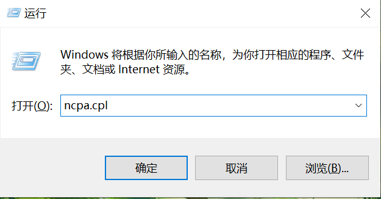

> 若没有WiFi图标，很大可能是在此处将WLAN禁用，右键点击启用后，检查网络是否恢复正常。
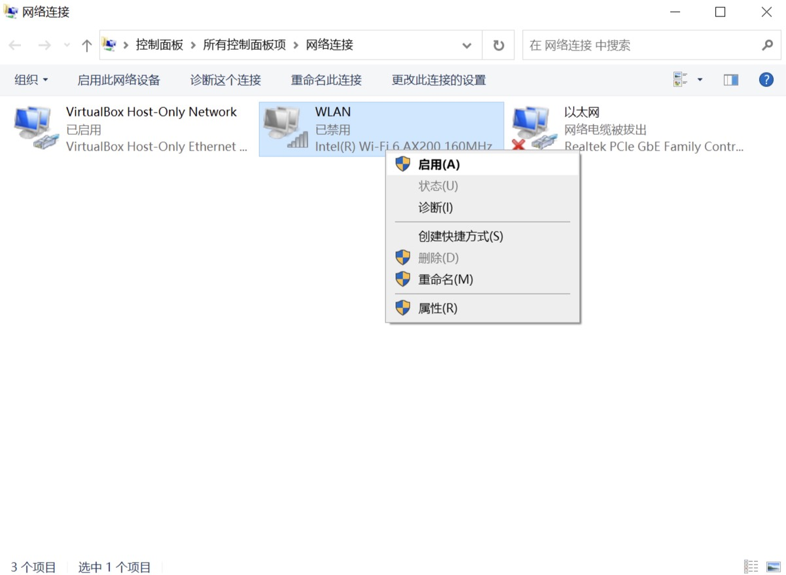

   + 不正常：跳至2
   + 正常但上不去网：跳至3
### 2. 检查网卡驱动
Win+X呼出快捷菜单，选择设备管理器，在网络适配器下是否能找到网卡驱动：
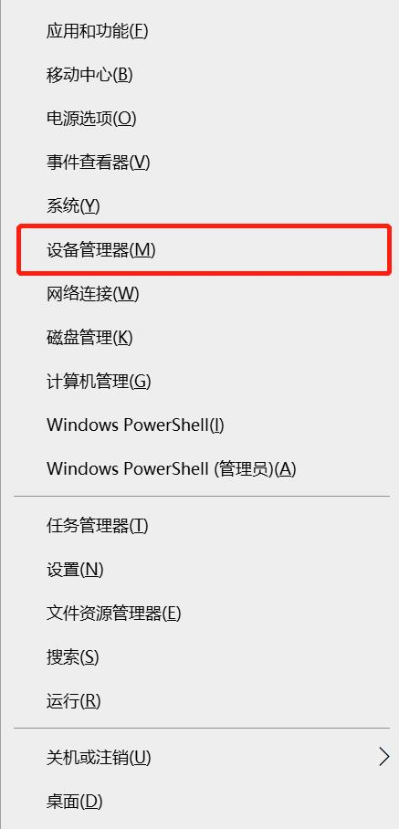

   + 看得见网卡驱动：跳至3
   + 看不见网卡驱动：重装驱动
### 3. 检查网络连接
Win+R运行CMD，输入`ping baidu.com`，回车：
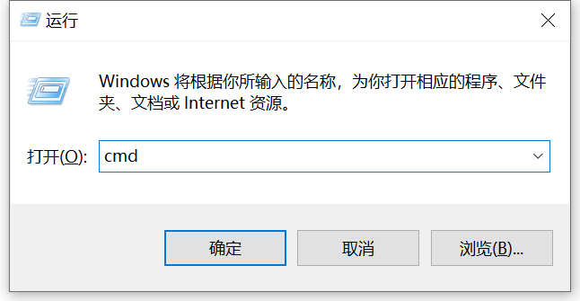
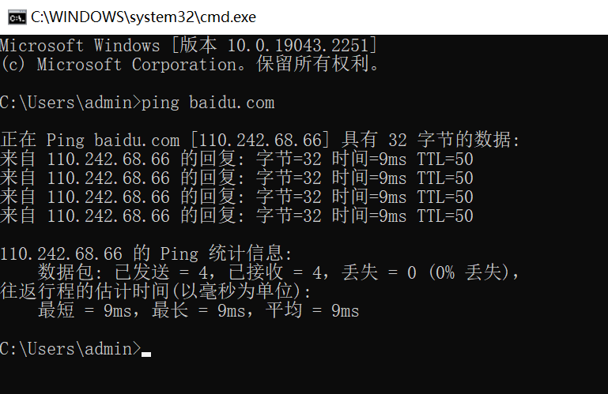

   + ping通了：跳至8
   + ping不通：跳至4
### 4. 检查代理设置
打开设置，在网络和Internet中，检查代理是否全关，如图：
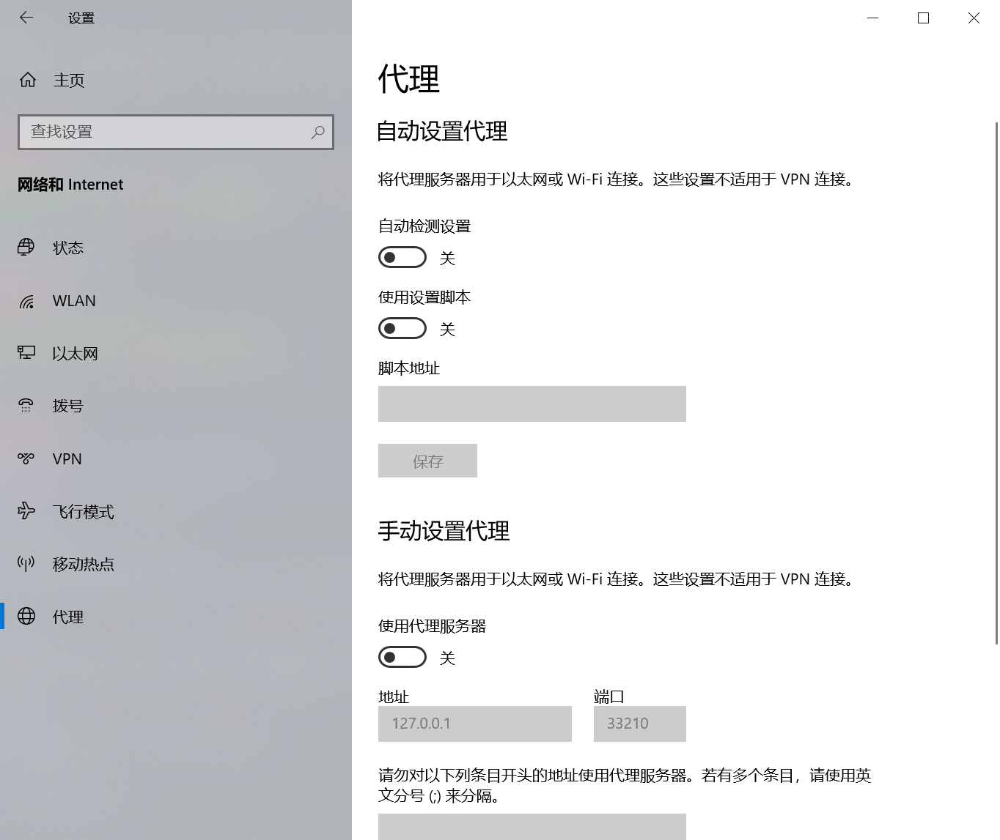

   + 如果有用过梯子，先打开一次，再关闭
   + 全关了：跳至5
   + 没关：关闭后重试3
### 5. 检查ip
在CMD中输入`ipconfig`，回车，检查是否拿到了正确的ip：
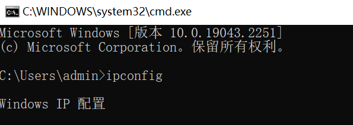
> 如果IP地址存在的话，表示本机被正常分配，否则就需要[将IP分配方式设置为自动获取](#设置ip和dns)，或手动设置IP地址。

   + 拿到了：跳至6
   + 没拿到：手机开个热点试试，没准不是电脑坏了而是网坏了
### 6. 
[检查hosts文件](#检查hosts文件)，[dns设置](#设置ip和dns)，或者相同网络环境换台电脑试一下

   + 成功了：重试3
   + 没成功：跳至7
### 7. 终极大法
+ 在CMD中输入`netsh winsock reset`，回车，之后重启计算机，并重试3
（若提示需要管理员权限，则Win+X呼出快捷菜单，选择Windows PowerShell(管理员)，在弹出的窗口中进行输入，如下图）
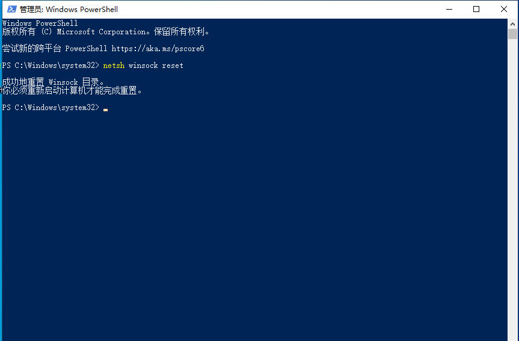

> Netsh winsock reset是一个命令提示程序，用于将winsock目录重置为默认设置或清除状态。如有时候上不了网或者网络出现问题经常用到它，简单地理解就是：重置程序通过操作系统链接网络的入口点。

+ 另一种方法是在设置中进行网络重置：
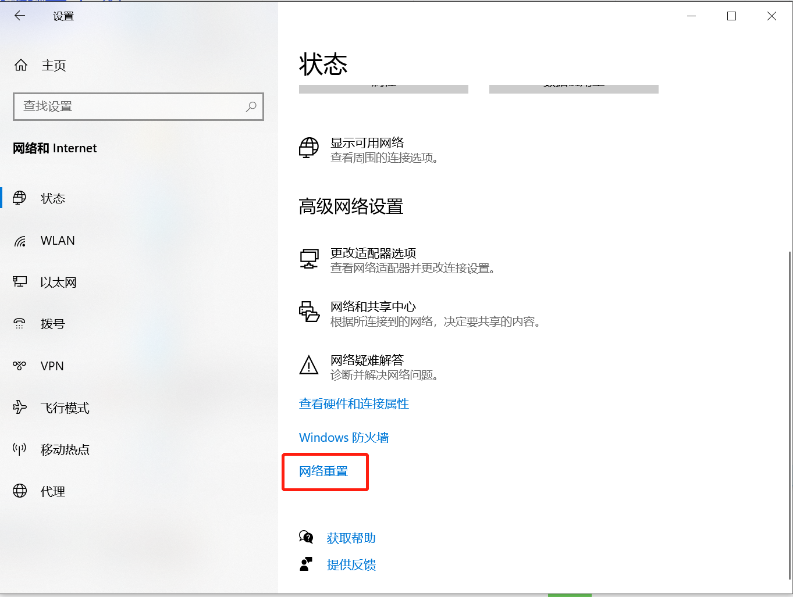

### 8. 打开浏览器，访问百度
   + 打不开：跳至4
   + 打开了：恭喜你问题解决了

## 补充

### 设置ip和dns

1. 在上面[第1步](#1-检查网络适配器)弹出的窗口中，右键点击用于网络连接的设备(此处为WLAN），选择属性：
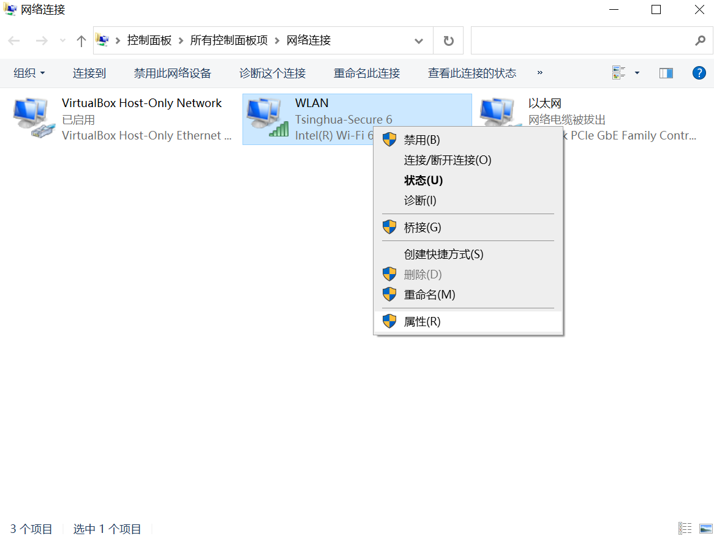

2. 进入网络连接属性界面，选中**Internet协议版本4（TCP/IPV4)**，点击下面的属性
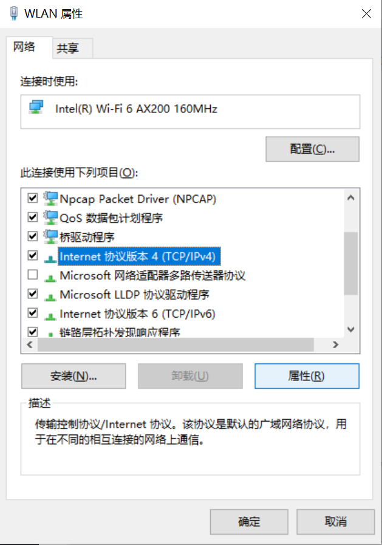

3. 常规属性界面选中**自动获取IP地址**以及**自动获取DNS服务器地址**即可
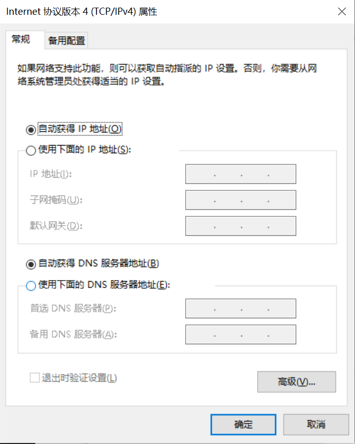

以下是可能用到的补充操作：
+ 检查DNS：
在CMD中输入`ipconfig /all` 在“DNS SERVER”（中文：DNS服务器）里找到你使用的DNS服务器地址。
+ 重新获取ip地址：
(回到第1步)右键单击设备选择“禁用”，然后会看到WLAN会变成灰色，说明已被成功禁用。
再重新启用网络连接，右键选择“启用”，等待电脑重新获取地址

> 手动设置DNS：
> 把DNS服务器地址改为1.1.1.1(Cloudflare DNS)或者8.8.8.8(Google Public DNS)
点击确定，进cmd，输入`ipconfig /flushdns`(刷新DNS解析缓存)，回车，刷新一下，就好了。

### 检查hosts文件
在C:\Windows\System32\drivers\etc中找到hosts文件，使用记事本打开：

`127.0.0.1 www.XXX.com`，表示计算机解析域名 www.XXX.com 时，会解析到 127.0.0.1 ，即本机IP。
> 上图中的`#`代表注释，后面的内容不生效，可以删除。

若hosts文件被修改，可能导致访问某些网站的域名时被解析到错误的ip，从而无法访问，将相应的语句删除或注释掉即可。
