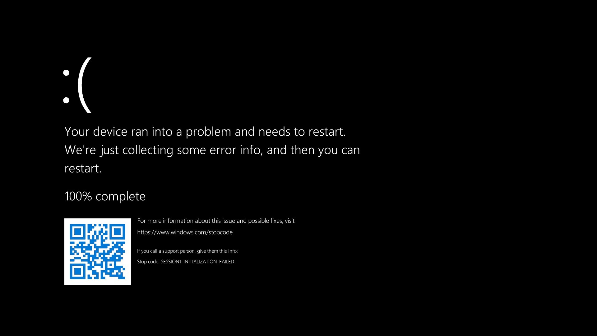
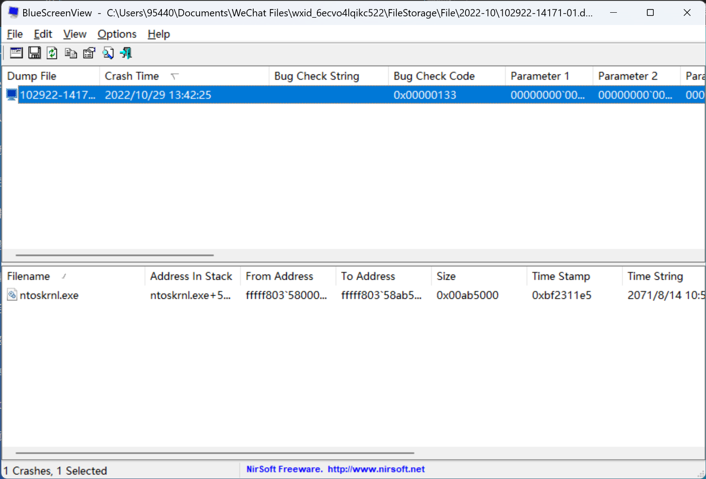
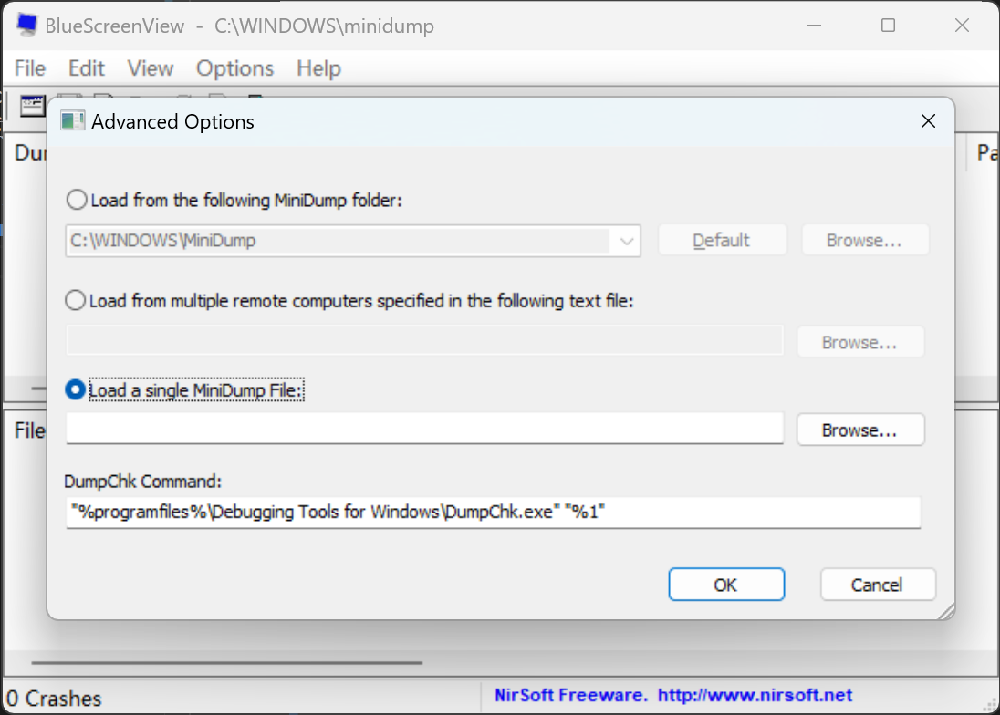

[蓝屏](https://en.wikipedia.org/wiki/Blue_screen_of_death)（BSOD / Bluescreen of Death）是Windows很重要~~而历史悠久~~的一种保护机制。

在系统遇到关键进程错误无法继续正常运行时，BSOD便会启动，在强制关闭电脑~~并宣判你未保存的进度死刑~~的同时尽可能留下一份错误报告。

> 在Win11正式版中蓝屏被改成了黑屏；而在Win10后期以及Win11的预览版中是绿屏。

本文主要试图分析的是短期多次、尤其是可复现的蓝屏错误。如果你用了大半年系统突然崩了，后面又很久没蓝屏过，那么请不用担心：Windows这么庞大的结构~~依托使山~~总有小概率偶尔抽风；但如果两三天蓝一次屏、甚至打开某一个软件必定蓝屏，那就是本文希望能帮助到的问题了。

# 零 准备工作 

对于科服队员，建议准备一个**dump文件分析程序**：
- BlueScreenView（[下载地址](https://www.nirsoft.net/utils/blue_screen_view.html)，科服工具箱、图吧工具箱也附带，首选）
- WinDbg（[下载和使用文档](https://learn.microsoft.com/zh-cn/windows-hardware/drivers/debugger/debugger-download-tools)，微软官方提供的分析工具）
- WinDbg Preview（新版WinDbg，在Microsoft Store搜索下载；官方文档同上）

BlueScreenView使用较简便，速度快且不需联网，但已经多年没更新，不排除在新系统上遇到兼容性问题的可能；快速排查时优先使用。  
WinDbg对内存转储文件的分析较全面、且有官方维护更新，但分析速度慢，且需要访问微软服务器下载symbols文件（巨硬的网速懂的都懂），建议当BSV不能识别时再使用。

# 一 dump文件与错误代码

[内存转储文件](https://en.wikipedia.org/wiki/Core_dump)（dump file，后缀为.dmp）是对指定程序指定时刻记录在内存中的信息的一份记录，简单来说就是给程序保存了个快照。

如果程序崩溃时执行了内存转储，那么它就会留下一个关于它遇到什么问题和在它生命最后一刻的状态的报告；对于操作系统也是如此。  
现在的新装Windows系统默认打开内存转储功能并设置为“小内存转储”项，对于普通的蓝屏解决这个设置已经足够。

> 蓝屏时内存转储的属性可以在**高级系统设置 - 启动与恢复设置 - 系统失败**中更改。对于“小内存转储”，dmp文件可以在`C:\Windows\Minidump\`中找到。
 {.is-info}

BSOD会显示一个错误代码（Stop Code），就如题图中的那样；有时下面还会多一行文字，指向导致系统崩溃的具体文件。

对于普通用户，错误代码和报错的文件是诊断蓝屏问题最重要的两个东西。但不是所有时候报错的文件都会显示在BSOD界面，错误代码也有数百条，大多数也都非常罕见，所以内存转储文件分析是很重要的事后查错途径。

> 蓝屏的发生通常也会被记录为“错误”级别的Windows系统日志，在事件查看器中可以查询。

# 二 如何分析蓝屏错误？

## 1 直接查看BSOD界面信息

---

在电脑突然蓝屏时，立刻拿起手机对屏幕拍照。**照片一定要能清晰地看到错误代码**。如果还有文件信息，那再好不过了；请直接跳到第3步，查询相应的代码吧。如果手速不够快、在蓝屏消失前没能成功拍照，那么就需要搬出内存转储文件了。

## 2 使用dump文件分析工具

---

如前文所述，小内存转储路径为`%systemroot%\Minidump\`或`C:\Windows\Minidump\`，命名方式为产生的时间。对于其他类型的内存转储，则是`%systemroot%\MEMORY.dmp`或`C:\Windows\MEMORY.dmp`。

> 复制这些文件可能需要管理员权限。 {.is-info}

### 2.1 BlueScreenView的使用

BSV在图吧工具箱的“其他工具”分类中。

打开软件之后，程序的默认路径就是小内存转储的目录。如果系统在崩溃时成功生成了转储文件，此时你应该已经能看到BSV帮你把蓝屏的时间、错误代码和导致系统崩溃的罪魁祸首都列出来了！



Bug Check String是错误代码的文字说明；Bug Check Code是错误代码的内部十六进制代码；Filename是和此次崩溃相关的文件。

> 如果是队员从客户电脑上复制来的、不在默认路径的文件，点选*Options - Advanced Options - Load a single Minidump File* 即可手动加载。{.is-info}

> 若文件数量过多，点击*Options - Lower Pane Mode - Only Drivers Found In Stack*，可以过滤出和本次崩溃关系最大的几个文件。{.is-info}

### 2.2 WinDbg的使用

[参考链接](https://learn.microsoft.com/zh-cn/windows-hardware/drivers/debugger/analyzing-a-kernel-mode-dump-file-with-windbg)

点击左上角**Files - Open source file**加载新的dump文件，待初步加载完成后在命令窗口下方输入，或直接点击窗口蓝色高亮的命令：
```
!analyze -v
```
等待分析完成，可以获取以下内容：  
`Bugcheck Analysis`下的第一行，是错误代码；  
`PROCESS_NAME`是发生错误的关键程序。这样就得到最关键的两条信息了。

## 3 判断可能的蓝屏原因

---

如果一切顺利的话，你应该已经能定位到什么程序发生了什么错误。下面一节将介绍几个常见且比较容易解决的蓝屏代码，但系统崩溃的原因千奇百怪，上面的这些途径也不一定能获取到两条关键信息（甚至有时候系统就什么都不给），如果有下节不包含的情形，请打开万能的搜索引擎吧！或者，请看第四节的通用解决办法。

# 三 常见蓝屏代码或程序的解决

> 动手前提醒：如果开机后仍有机会进入桌面，请先检查客户电脑BitLocker的开启情况。对Win10和Win11，直接在任务栏搜索框输入“bitlocker”，应当有“磁盘加密”或“BitLocker选项”的入口。  
后文的恢复环境或PE下操作可能会触发磁盘保护，因此如果条件允许务必先关闭BitLocker。{.is-warning}

## 文件

---

### nvlddmkm.sys

此为Nvidia显卡驱动的主要程序之一。引发蓝屏的问题往往是驱动更新失败或驱动损坏。遇到此问题时，建议清洁重装显卡驱动。

启动电脑（能进桌面时）/安全模式下启动（不能进桌面时），打开设备管理器，找到“显示适配器”，找到独显“NVIDIA xxxxx”，右键-“卸载此设备”**同时勾选“尝试删除此设备的驱动程序”**。

如果安全模式也进不了桌面，或设备管理器卸载不了驱动，请使用PE打开Dism++，使用驱动管理按照同样的方法找到N卡驱动并卸载。

若以上方法都不奏效，使用Win-to-go看是否能启动并检测到显卡。到这一步的话就需要考虑硬件是否出问题了（）

> 最好不要尝试在Win-to-go上安装显卡驱动！科服的启动盘是大家共用的，你永远不知道它插入的下一个电脑里面是N卡还是A卡。已经有多个报道证明安装另一家的显卡驱动会引发系统不稳定。{.is-warning}