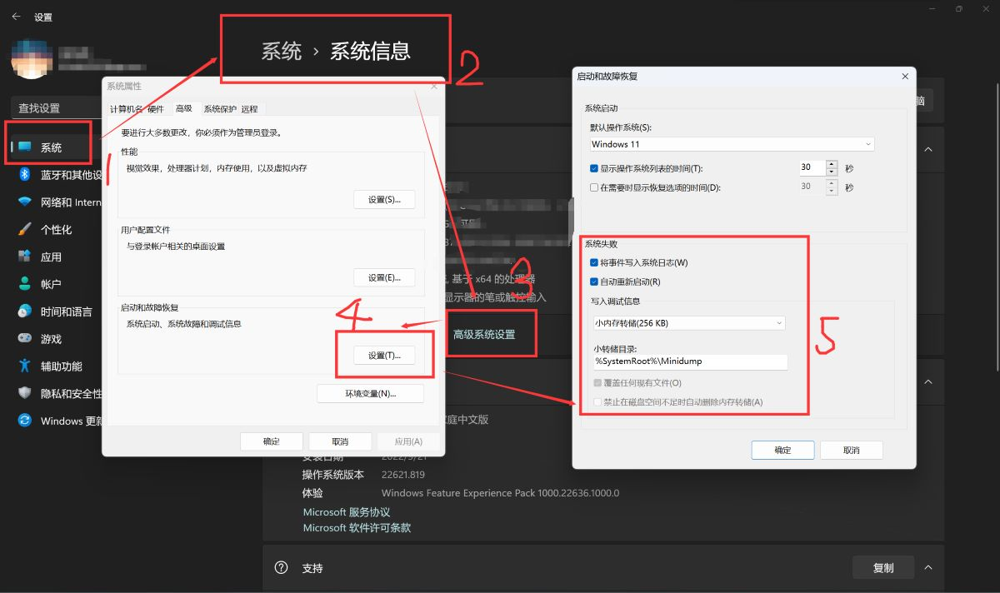
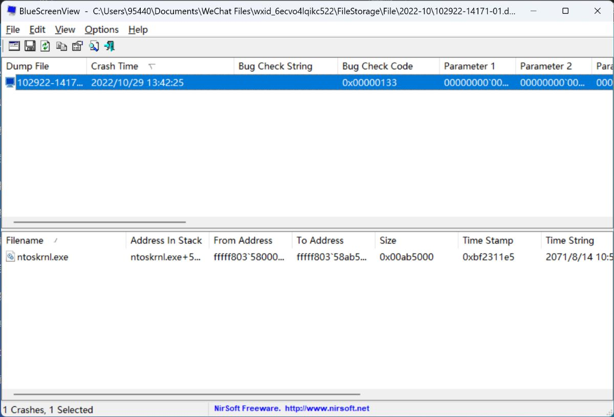
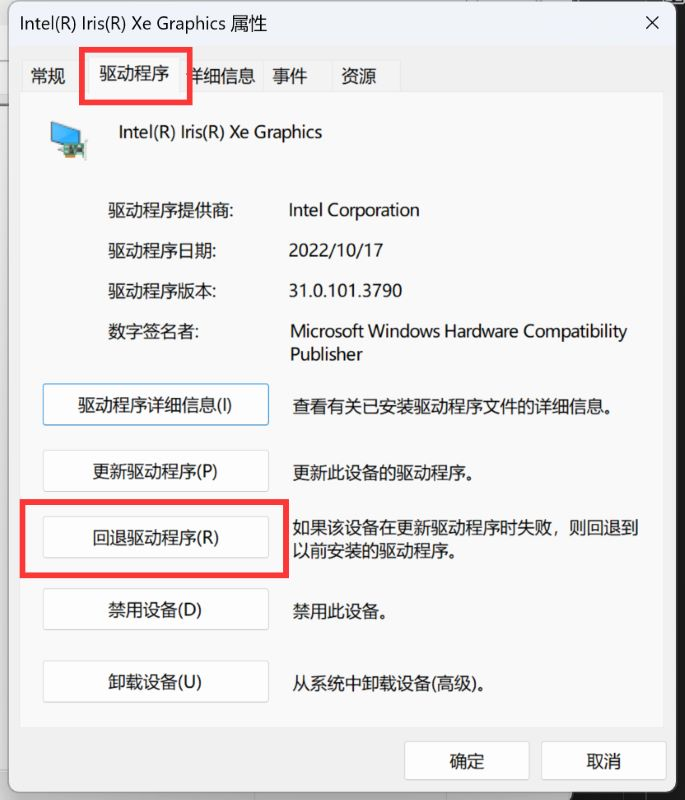
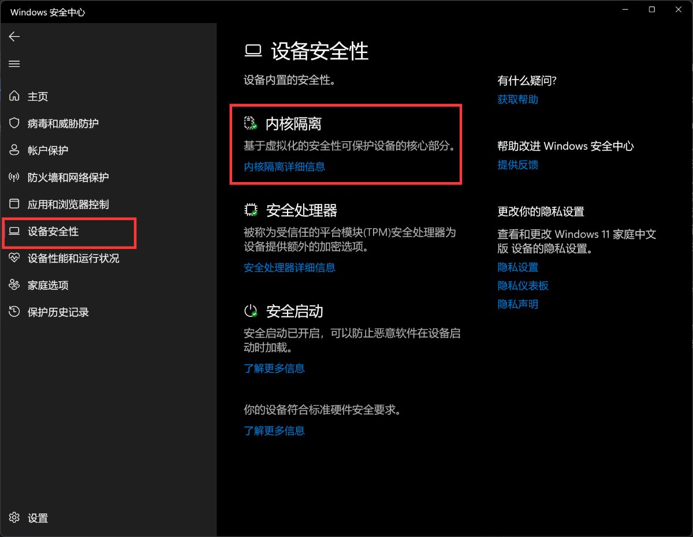
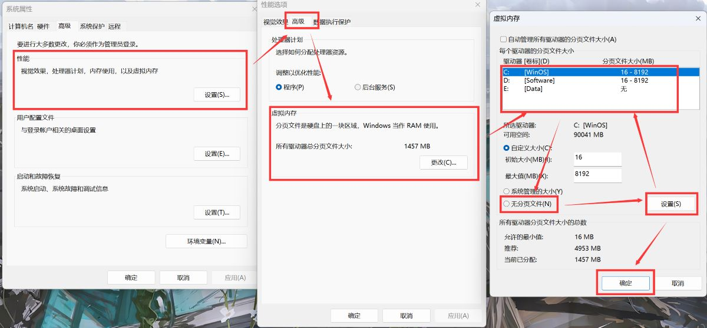

[蓝屏](https://en.wikipedia.org/wiki/Blue_screen_of_death)（BSOD / Bluescreen of Death）是Windows很重要~~而历史悠久~~的一种保护机制。

在系统遇到关键进程错误无法继续正常运行时，BSOD便会启动，在强制关闭电脑~~并宣判你未保存的进度死刑~~的同时尽可能留下一份错误报告。

> 在Win11正式版中蓝屏被改成了黑屏；而在Win10后期以及Win11的预览版中是绿屏。{.is-info}

本文主要试图分析的是短期多次、尤其是可复现的蓝屏错误。如果你用了大半年系统突然崩了，后面又很久没蓝屏过，那么请不用担心：Windows这么庞大的结构~~依托使山~~总有小概率偶尔抽风；但如果两三天蓝一次屏、甚至打开某一个软件必定蓝屏，那就是本文希望能帮助到的问题了。

> 如果电脑超过频，请先在BIOS中关闭所有超频选项！~~（不过懂超频的对蓝屏应该也习惯了吧x）~~ {.is-warning}

# 0 准备工作


对于科服队员，建议预先准备一个**dump文件分析程序**：
- BlueScreenView（[下载地址](https://www.nirsoft.net/utils/blue_screen_view.html)，科服工具箱、图吧工具箱也附带，首选）
- WinDbg（[下载和使用文档](https://learn.microsoft.com/zh-cn/windows-hardware/drivers/debugger/debugger-download-tools)，微软官方提供的分析工具）
- WinDbg Preview（新版WinDbg，在Microsoft Store搜索下载；使用文档同上）

BlueScreenView使用较简便，速度快且不需联网，但已经多年没更新，不排除在新系统上遇到兼容性问题的可能；快速排查时优先使用。  
WinDbg对内存转储文件的分析较全面、且有官方维护更新，但分析速度慢，且需要访问微软服务器下载symbols文件（巨硬的网速懂的都懂），建议当BSV不能识别时再使用。

# 1 dump文件与错误代码

[内存转储文件](https://en.wikipedia.org/wiki/Core_dump)（dump file，后缀为.dmp）是对指定程序指定时刻记录在内存中的信息的一份记录，简单来说就是给程序保存了个快照。

如果程序崩溃时执行了内存转储，那么它就会留下一个关于它遇到什么问题和在它生命最后一刻的状态的报告；对于操作系统也是如此。  
现在的新装Windows系统默认打开内存转储功能并设置为“小内存转储”项，对于普通的蓝屏解决这个设置已经足够。

> 蓝屏时内存转储的属性可以在**高级系统设置 - 启动与恢复设置 - 系统失败**中更改。对于“小内存转储”，dmp文件可以在`C:\Windows\Minidump\`中找到。
 {.is-info}

BSOD会显示一个错误代码（Stop Code），就如题图中的那样；有时下面还会多一行文字，指向导致系统崩溃的具体文件。

对于普通用户，错误代码和报错的文件是诊断蓝屏问题最重要的两个东西。但不是所有时候报错的文件都会显示在BSOD界面，错误代码也有数百条，大多数也都非常罕见，所以内存转储文件分析是很重要的事后查错途径。

> 蓝屏的发生通常也会被记录为“错误”级别的Windows系统日志，在事件查看器中可以查询。

# 2 如何分析蓝屏错误？

## 2.1 直接查看BSOD界面信息

在电脑突然蓝屏时，立刻拿起手机对屏幕拍照。**照片一定要能清晰地看到错误代码**。如果还有文件信息，那再好不过了；请直接跳到第3步，查询相应的代码吧。如果手速不够快、在蓝屏消失前没能成功拍照，那么就需要搬出内存转储文件了。

## 2.2 使用dump文件分析工具

如前文所述，小内存转储路径为`%systemroot%\Minidump\`或`C:\Windows\Minidump\`，命名方式为产生的时间。对于其他类型的内存转储，则是`%systemroot%\MEMORY.dmp`或`C:\Windows\MEMORY.dmp`。

> 复制这些文件可能需要管理员权限。 {.is-info}

### 2.2.1 BlueScreenView的使用

BSV在图吧工具箱的“其他工具”分类中。

打开软件之后，程序的默认路径就是小内存转储的目录。如果系统在崩溃时成功生成了转储文件，此时你应该已经能看到BSV帮你把蓝屏的时间、错误代码和导致系统崩溃的罪魁祸首都列出来了！



Bug Check String是错误代码的文字说明；Bug Check Code是错误代码的内部十六进制代码；Filename是和此次崩溃相关的文件。

> 如果是队员从客户电脑上复制来的、不在默认路径的文件，点选**Options - Advanced Options - Load a single Minidump File** 即可手动加载。{.is-info}

> 若文件数量过多，点击**Options - Lower Pane Mode - Only Drivers Found In Stack**，可以过滤出和本次崩溃关系最大的几个文件。{.is-info}

### 2.2.2 WinDbg的使用

[参考链接](https://learn.microsoft.com/zh-cn/windows-hardware/drivers/debugger/analyzing-a-kernel-mode-dump-file-with-windbg)

点击左上角**Files - Open source file**加载新的dump文件，待初步加载完成后在命令窗口下方输入，或直接点击窗口蓝色高亮的命令：
```
!analyze -v
```
等待分析完成，可以获取以下内容：  
`Bugcheck Analysis`下的第一行，是错误代码；  
`PROCESS_NAME`是发生错误的关键程序。这样就得到最关键的两条信息了。

## 2.3 判断可能的蓝屏原因

如果一切顺利的话，你应该已经能定位到什么程序发生了什么错误。下面一节将介绍几个常见且比较容易解决的蓝屏代码，但系统崩溃的原因千奇百怪，上面的这些途径也不一定能获取到两条关键信息（甚至有时候系统就什么都不给），如果有下节不包含的情形，请打开万能的搜索引擎吧！或者，请看第四节的通用解决办法。

# 3 常见蓝屏代码或程序错误

> 动手前提醒：如果开机后仍有机会进入桌面，**请先检查电脑BitLocker的开启情况**。对Win10和Win11，直接在任务栏搜索框输入“bitlocker”，应当有“磁盘加密”或“BitLocker选项”的入口。  
后文的恢复环境或PE下操作可能会触发磁盘保护，因此如果条件允许务必先关闭BitLocker。{.is-warning}

> 再次强调，超频导致系统不稳定就先关闭超频！多数情况下系统如果遇到显卡、CPU、内存超频导致的蓝屏，也会在下一次启动时将对应的超频选项恢复默认。{.is-warning}

> 笔者注：以下内容是我个人遇到的印象比较深的一些情况，受限于个人水平和经验是绝对不全面的！欢迎更多队员补充。{.is-info}

## 3.1 程序

### 3.1.1 nvlddmkm.sys

此为Nvidia显卡驱动的主要程序之一。引发蓝屏的问题往往是驱动更新失败或驱动损坏。遇到此问题时，建议清洁重装显卡驱动。

- 启动电脑（能进桌面时）/安全模式下启动（不能进桌面时），打开设备管理器，找到“显示适配器”，找到独显“NVIDIA xxxxx”，右键-“卸载此设备”**同时勾选“尝试删除此设备的驱动程序”**。重启电脑后安装新驱动（在NV官网可下载）。

> 安全模式的启动方法参见第四节

- 如果安全模式也进不了桌面，或设备管理器卸载不了驱动，请使用PE打开Dism++，使用驱动管理按照同样的方法找到N卡驱动并卸载。

- 若以上方法都不奏效，可以尝试使用Win-to-go看是否能启动并检测到显卡。到这一步的话就需要考虑硬件是否出问题了。

> 请不要在Win-to-go上自行安装显卡驱动！科服的启动盘是大家共用的，你永远不知道它插入的下一个电脑里面是N卡还是A卡。安装不对应的显卡驱动会引发系统不稳定。{.is-warning}

### 3.1.2 含amd/catalyst等关键字的程序

若电脑为A卡则是AMD的显卡驱动出了问题，参照N卡驱动的解决方法。

### 3.1.3 含360/pcmgr/protect/prot等关键字的程序

大概率是杀毒软件崩溃了，尝试在安全模式下卸载，或者参照第四节使用系统还原功能。

*(to be continued)*

## 3.2 错误代码

### 3.2.1 IRQL_NOT_LESS_OR_EQUAL
这个问题一般是驱动出问题导致的。检查最近是否更新过驱动或者杀毒软件，并尝试回滚出问题的驱动或者按照上面的方法清洁安装。

> 回滚驱动程序的方法：   
> 打开设备管理器 - 在有问题的设备上右键 - 属性 - 驱动程序 - 回退驱动程序 

很少见的情况下内存问题也可能产生这个错误代码，请参见下文解决。

### 3.2.2 DPC_WATCHDOG_VIOLATION

这个问题很多时候也是由驱动故障导致的。

### 3.2.3 MEMORY_MANAGEMENT

这个问题是运行内存（RAM）出现错误导致的。反复出现时往往内存硬件出了问题或者是接口老化接触不良，可以尝试以下方法排查：

- 拆机，拔出内存，用橡皮擦除金手指上的氧化层，重新插上；

- 放静电；
  
- 使用[Memtest86](https://www.memtest86.com/)（包含于图吧工具箱）检测内存工作状态；  
*(待编辑 memtest的使用方法/PE启动方法)*

- 如果有多条内存且Memtest不通过，逐一检查各条内存和各个插槽（对台式机），每次测试只插一条内存。查出损坏的内存或插槽，就拿去退换吧~

### 3.2.4 SYSTEM_SERVICE_EXCEPTION

系统关键服务崩溃，有可能是系统更新出问题，也有可能是杀毒软件误杀。  
先关闭或卸载第三方杀毒软件；然后参阅第四节内容卸载系统更新。

### 3.2.5 PAGE_FAULT_IN_NONPAGED_AREA

> **这是在Win10上的一个已知BUG：** Windows Defender在某个版本引入了内存完整性保护，但其与大量第三方软件功能出现冲突导致系统崩溃。  
> 尽管现在这个BUG已经基本修复，但仍然会遇到一些因为这个功能导致第三方软件无法正常工作的问题。在Win11上该功能默认开启，但个人推荐还是关了它。（笔者的奥创中心在Win11某次更新之后就读取不到CPU温度和风扇转速了，捣鼓半天发现把这个功能关掉就恢复正常）{.is-info}

这个问题一般由系统对内存和虚拟内存的不正常管理造成。可以尝试：

- **优先** 关闭Windows Defender的内存完整性功能：Windows 安全中心 - 设备安全性 - 内核隔离 - 内存完整性



- 重新设置虚拟内存： 
  1. 在高级系统设置中关闭虚拟内存，重启，再重新分配虚拟内存大小；
  2. 如果进不了桌面，则在PE下删除系统盘根目录下的`pagefile.sys`文件。

> 关闭和重新分配虚拟内存：  
高级系统设置 - 性能选项 - 高级 - 虚拟内存更改 -（如有）取消勾选“自动管理所有驱动器的分页文件大小” - 将所有驱动器置为“无分页文件”（每一次选择后都要点“设置”）- 确定
 {.is-info}

在少数情况下这个蓝屏也可能由内存或硬盘的硬件问题造成。如果重置虚拟内存不能解决问题，请关闭虚拟内存，并检查运行内存或硬盘是否有硬件错误。（见MEMORY_MANAGEMENT的解决或第四节）
 
### 3.2.6 含KERNAL/CRITICAL等字样的错误代码

这些错误代码通常代表系统核心文件出错或损坏。请参阅第四节的通用解决办法。

*(to be continued)*

# 4 一些通用的解决方法

本节内容主要针对第三节未提及或涉及Windows系统核心文件的问题。这些方法比较无脑，但数据丢失的风险更大。

> 采取以下所述的方法可能会导致系统或者第三方程序的设置回退以及个人文件丢失，请在操作前务必做好数据备份！{.is-warning}

## 4.1 启动Windows恢复环境

[Windows恢复环境](https://learn.microsoft.com/zh-cn/windows-hardware/manufacture/desktop/windows-recovery-environment--windows-re--technical-reference?view=windows-11)（Windows Recovery Environment, WinRE）是Windows自带的、用于系统故障排除的PE环境。下文将多次使用到WinRE，**进入WinRE的方法有这些：**

- 在开始菜单或登录界面按住Shift键的同时重启；
- 对于Win10，在设置 - 更新与安全 - 恢复 - 高级启动；
- 对于Win11，在设置 - 系统 - 恢复 - 高级启动；
- 短时间内连续两次系统启动失败（可以通过在开机后立即强制关机来触发）；
- 某些电脑的一键恢复按钮。

## 4.2 卸载、回滚系统更新

不正常的系统更新可能会导致崩溃。为了解决这个问题，可以使用Windows自带的系统更新卸载功能。  
如果在系统更新不久后频繁发生蓝屏，那么卸载更新可能会很有帮助。

### 4.2.1 系统中卸载更新

Win10的卸载更新功能位于设置 - 更新与安全 - Windows更新 - 查看更新历史记录 - 卸载更新（在最上面）；

Win11的位于设置 - Windows更新 - 更新历史记录 - 卸载更新（在最下面）。

进入WinRE后，卸载更新选项位于疑难解答 - 高级选项 - 卸载更新。质量更新和功能更新两项都需要尝试卸载。  
（该功能疑似仅限Win11，待考证）

### 4.2.2 回滚到上一个版本

> 这个选项仅在Windows大版本更新（一般是半年更新）后才起效，并且10天后旧版本的文件会被清理。同样地，在大版本更新后多次蓝屏可以回退；这个选项也适用于不习惯新版系统的用户。{.is-info}

Win10的回滚选项位于：设置 - 更新与安全 - 恢复 - 回退到之前的Windows；
Win11的位于：设置 - 系统 - 恢复 - 返回。

## 4.3 WinRE自动修复与启动修复

这两个选项可以让Windows尝试自己修复系统文件的错误，不过一般在系统启动失败时它们会自动执行，所以手动执行用处不大。（不过也是可以尝试的）

## 4.4 安全模式

安全模式需要通过WinRE启动，通过 **疑难解答 - 高级选项 - 启动设置（更改Windows启动行为）** 执行。重启后，可选不带网络的安全模式（F4）和带网络的安全模式（F5）。

由于安全模式仅加载基本服务项、很多驱动和第三方任务都不会开启，因此它是在电脑无法以常规方式启动时很有效的紧急使用的途径。在安全模式下可以浏览硬盘文件、运行cmd命令、卸载和安装驱动程序、使用工具箱的软件排查问题。

## 4.5 系统还原

> 强烈推荐看到这里的各位开启系统还原！尽管它已经渐渐失去存在感了，但这仍然是个解决更新软件/系统补丁/驱动之后崩溃问题极有效的方法，笔者屡试不爽。一个高成功率的方法付出的代价只有少量磁盘空间和可能重装一部分软件的时间。{.is-info}

> 在现版本的Windows中，手动的系统还原配置**默认关闭**；但操作系统可能*不定时*保留一个还原点。（待确认）{.is-info}

### 4.5.1 开启和维护系统还原点

在Win10和Win11中，系统还原可以在任务栏搜索框中直接搜索到（名字可能为“创建还原点”）。  
建议保持系统分区的自动创建还原点功能开启，并分配5GB左右的空间。

### 4.5.2 使用系统还原

在WinRE中，通过**疑难解答 - 高级选项 - 系统还原** 执行。如果近期产生了多个还原点，则尝试从最近的一次备份开始操作，直到机器正常工作为止。

> 时间过早的还原点（7天以上）不建议使用：它们影响的程序可能过多，并且对近期更新产生的蓝屏也没什么帮助。{.is-warning}

> 在进行系统还原前，**务必和客户确认受影响的第三方软件！** 系统还原不仅还原系统本身，也还原这段时间更新过的第三方软件，它们会被回滚到旧版本。有一部分程序回滚后可能会出bug甚至无法打开，请预先告知客户可能需要卸载重装某些TA使用的软件的风险。{.is-warning}

> 系统还原一般不会影响个人文档，但如果涉及的软件中有重要数据，建议先备份。{.is-warning}

## 4.6 磁盘检查和映像修复

系统映像恢复功能和磁盘检查对某些系统服务导致的蓝屏有较好的效果。最好能进带网络的安全模式；如果不能进安全模式，WinRE也提供基本命令提示符窗口以供尝试，就是安全启动上面那货。  

> 请使用管理员模式打开cmd；另请参见“常用命令”页面。{.is-info}

### 4.6.1 磁盘检查

```
chkdsk /f 
```
该命令会检查并修复系统盘上文件的索引错误。

### 4.6.2 系统完整性扫描

```
sfc /scannow
```
该命令会扫描系统组件并给出是否存在不完整文件的报告。

### 4.6.3 映像修复

```
dism /online /cleanup-image /restorehealth
```
该命令会尝试利用本地镜像备份或联网获取镜像来修复损坏的系统组件。

## 4.7 硬盘状态检查

如果硬盘状况较差、存在坏道，那么系统不稳定也是必然的。如果蓝屏代码指向了和存储有关的问题（包括核心服务崩溃的问题），推荐使用工具查看硬盘健康度。

- CrystalDiskInfo读取硬盘时会在主界面显示健康程度和SMART信息。
- DiskGenius在“磁盘”选项卡中可以查看SMART信息；
- 另外可以使用DG的扫描坏道功能。这个功能对机械硬盘的效果比较好，对固态硬盘效果一般（且会消耗少量写入寿命）。

## 4.8 使用外部备份恢复

仅适用于有这样的备份的客户，基本上见不到，而且会定期备份的人一般也能自行恢复。  
同样进入WinRE环境的高级选项，可以从外部系统映像恢复。

*(to be continued)*

## 4.99 重装系统

如果以上的方法都不能解决系统反复蓝屏的问题，那么很遗憾，可能需要动用这个终极办法了。关于重装系统的方法和注意事项，请参见相关页面。

# 5 结语

蓝屏是非常玄学的玩意，总有意想不到的事情发生。我就听说过有一个客户是CPU坏了导致蓝屏的，还有昨天（2022.11.26）线下有一位客户在正常系统中跑Memtest必蓝屏而在PE里跑就啥事没有的。  
但是大部分的蓝屏事件都发生在系统更改之后，所以通常的解决就是“什么变了”-“有没有办法把它变回去”，现在也有了系统崩溃自动撤销更改的保护机制，可以说普通用户遇到难以解决的蓝屏问题是越来越少了。

*希望Windows使山不倒，微门*

## 参考

[WinRE故障排除功能](https://learn.microsoft.com/zh-cn/windows-hardware/manufacture/desktop/windows-re-troubleshooting-features?view=windows-11)

[Windows中的恢复选项](https://support.microsoft.com/zh-cn/windows/windows-%E4%B8%AD%E7%9A%84%E6%81%A2%E5%A4%8D%E9%80%89%E9%A1%B9-31ce2444-7de3-818c-d626-e3b5a3024da5)

[蓝屏错误疑难解答](https://support.microsoft.com/zh-cn/sbs/windows/%E8%A7%A3%E5%86%B3%E8%93%9D%E5%B1%8F%E9%94%99%E8%AF%AF-5c62726c-6489-52da-a372-3f73142c14ad)

[蓝屏代码PAGE_FAULT_IN_NONPAGED_AREA的解决方法](https://www.codeprj.com/blog/8a89cc1.html)

[使用BlueScreenView帮助对死亡蓝屏进行故障排除](https://blog.csdn.net/cum44153/article/details/109032291)

[图吧工具箱](http://www.tbtool.cn/)

...

---

<p align=right><em>author: wuhy19 (horseant0592)<br>  
version: 1.1.221127<br>
last edit: 2022/11/27 10:45</em></p>

